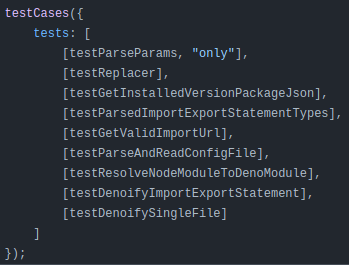

# cases-of-test

It groups the test cases into a collection of tests so that you can do the following

```js
testCases({
    tests: [
        [testAlphabet],
        [testArray],
        [testCapitalizeUncapitalize],
        [testCreateGranulaString],
        [testIsEqual],
        [testInRangeOfMinMax],
        [testNumber, 'only'],
        [testReverse, 'only'],
        [testWhitespace],
    ],
});
```

Which will then execute `testNumber` and `testReverse` **only** by your testing framework

It will also abort the tests when it detect there are tests flagged with `only` and thus fail the CI/CD

## Why I made this

I used to add `only` to `describe` or/and `test/it` a lot in my codebase back in the days like so

```js
describe.only('...', () => {
    it.only('...', () => {
        // tests...
    });
});
```

The problem is that I won't know whether all of the tests are executed in CI/CD environment, since it doesn't warn that there are tests config with `only`.
In the end, I have to open the log to find out

Other times I write code like this,

```js
import test1 from 'test1';
import test2 from 'test2';

test1();
test2();
```

And I will comment out irrelevant test when I wanna test new changes

In the end I forgot to uncomment the commented tests in CI/CD environment

## Output

When there are test flagged with `only`, the following will happen in CI/CD environment

| Setup                                      | Output                                              |
| ------------------------------------------ | --------------------------------------------------- |
|  |  |

**Images from the log of Github Actions of `denoify` repository**

## How to use

1. Install this package
2. Have a testing framework ready, i.e. `jest`, `vitest`
3. Create a file to wrap your tests
4. Set the entry point of the testing framework to that file you created
5. Run the test command

## Disclaimer

1. This is not a testing framework
